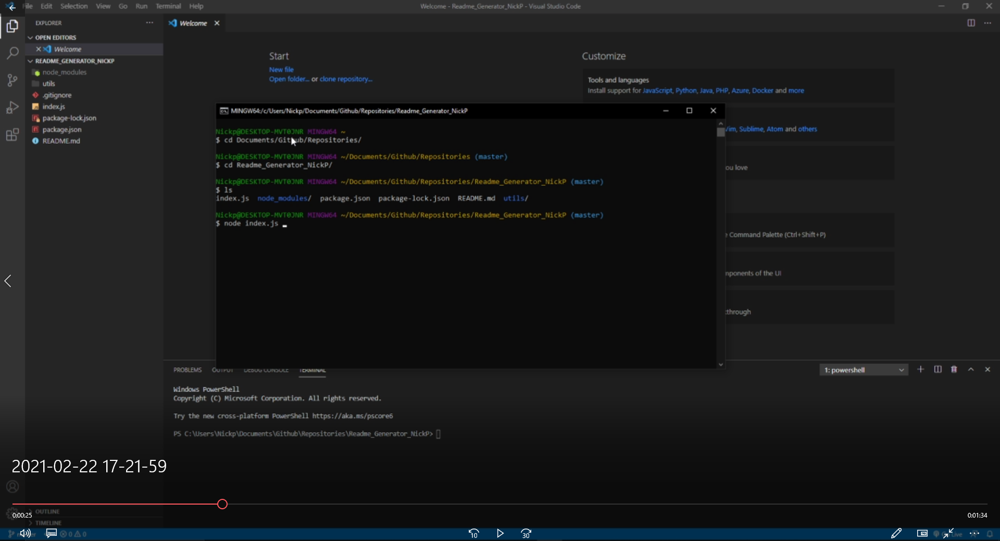

# Readme Generator NickP

## Description 

This project is to create a readme generator to save time making a readme for each new project I create. You run the program with node in terminal and then asnwer the questions to generate a readme based on you inputs.

## Table of Contents

  * [Installation](#installation)
  * [Usage](#usage)
  * [Links](#links)

## Installation

  You must have Node.js installed, and you can do so by going to https://nodejs.org/en/ to download and install it. Then you need to install inquirer within your forked repo folder with the following command in terminal "npm install inquirer".

## Usage

  You first navigate into the repo file within terminal then you start the program with "node index.js" then answer the following questions to generate your readme.

  Navigate to project folder, and then enter "node index.js".
  
  Enter your answers!
  
  View your generated Readme!
  

  Video Demo! 
  https://drive.google.com/file/d/1_vATfj-I6EPaq2hgkNN24ljQuKq8uSh9/view?usp=sharing
  
## Links

https://github.com/Nickpodski/Readme_Generator_NickP - Git Hub Repo
  